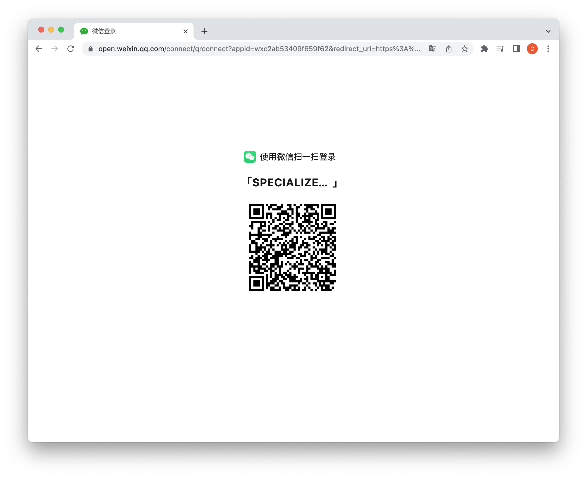
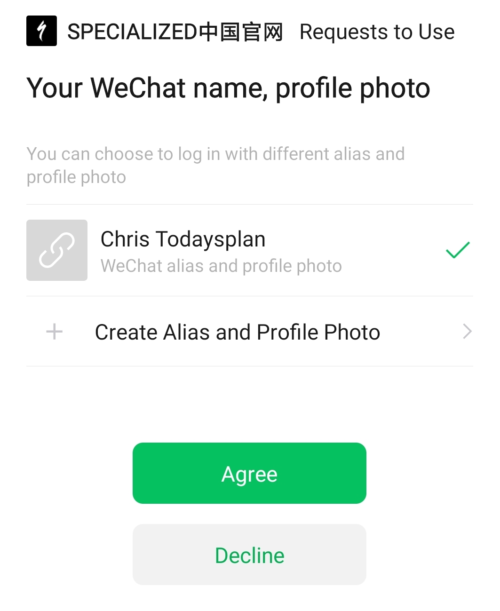

# WeChat Authentication

The workflow describes how to authenticate with the Specialized Identity API using WeChat credentials. This workflow requires two devices, a desktop or tablet on which the user wants to log into Specialized, and a smartphone with the WeChat app to handle the authentication steps.

If you attempt to use this workflow with a WeChat user who has not yet registered with Specialized, the workflow will fail. However, in this scenario, Specialized retains the user's `unionId` and generates a one-time, pre-authorization `unionCode` allowing the user to login and register their account with the `unionCode` using the [login endpoint](../sbc_auth_login/).


## Workflow

1. Open the [WeChat account connect page in your desktop or tablet's browser](https://example.com). For best results, use Google Chrome or a browser based on Chromium. 

	```
	URL Redacted 
	```

	Once you navigate to the page, a QR code is displayed in your browser.

	

1. With your smartphone, open the WeChat app and navigate to **Discover**, then select the Scan option. Scan the code with your smartphone's camera.

	If the code is successfully scanned, WeChat then prompts you to accept Specialized's access to your account.

	

	Tap Agree to continue.

1. Upon agreement, the WeChat account page automatically redirects your desktop/tablet's browser to a URL containing your authentication code as a URL parameter. Save this code and use it to authenticate using the login in endpoint as describe below:

	```
	curl --location --request POST 'URL REDACTED' \
	--header 'Api-Key: specialized-china-dev-test' \
	--header 'Content-Type: application/json' \
	--data-raw '{
    	"appId" : "REDACTED",
    	"secret" : "REACTED",
    	"code" : "REDACTED"
	}'
	```

	On a successful request, the endpoint returns the user's bearer token. For more information about the login endpoint, [refer to the documentation](../sbc_auth_login/).

## If the WeChat user is unregistered

As noted, if the WeChat user is not already registered with Specialized, the login endpoint returns a 401 error with the following response:

```json
{
    "code": 401906,
    "title": "GENERIC_UNAUTHORIZED",
    "detail": "Login failed",
    "errors": [
        {
            "code": 401102,
            "title": "INVALID_USERNAME_OR_PASSWORD",
            "detail": "Incorrect username or password",
            "source": "unionId",
            "meta": {
                "unionCode": "<OTC>",
                "unionId": "<UNIONID>"
            }
        }
    ]
}
```

In this event, you can resend the login request, and this time include the user's `unionId` and `unionCode` in your request along with the user's other credentials as [detailed in the login documentation](../sbc_auth_login/).

Note, the `unionCode` can only be used once, and then must be regenerated.

```curl
curl --location --request POST 'URL REDACTED' \
	--header 'Content-Type: application/json' \
	--header 'Api-Key: {clientId}' \
	--data-raw '{
		"tn":"+8610000000000",
		"code":"123456",
		"unionId": "{{unionId}}",
		"unionCode":"{{unionCode}}"
		}''

```

On a successful request, the WeChat user is registered with Specialized and granted a bearer token.