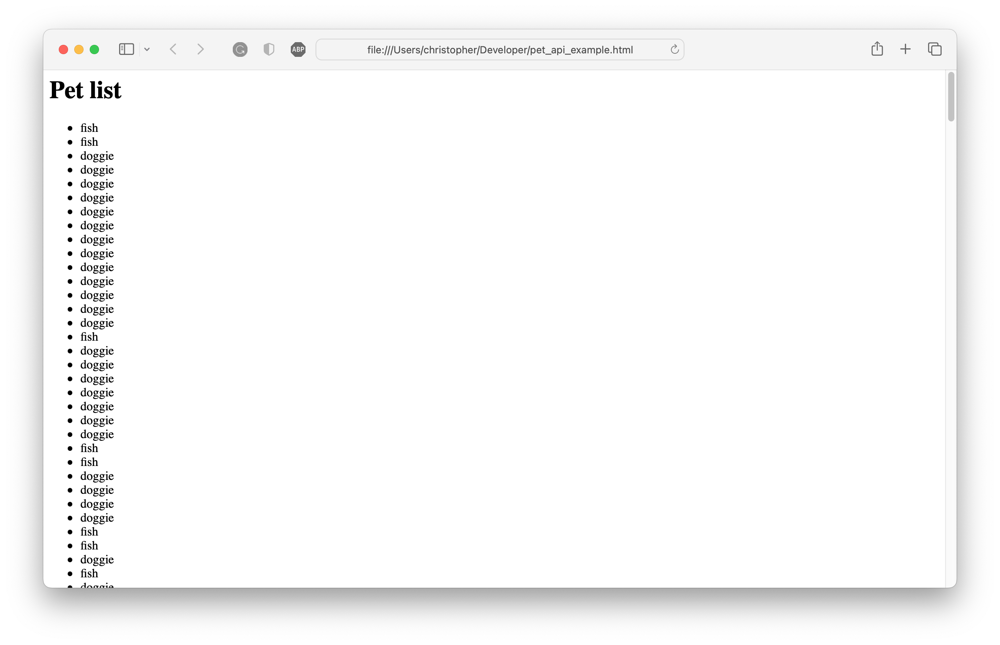

# Petstore API

This guide introduces Swagger's Petstore API and demonstrates how to retrieve and display pet data on a simple HTML page using JavaScript. We assume you are familiar with HTML, JavaScript (including arrow functions, the Fetch API and Promises) and REST APIs. Our provided example code uses vanilla JavaScript with no additional frameworks or libraries required.

## About the Petstore API

Swagger provides an example API for a fictitious Petstore. The API includes a collection of authenticated and unauthenticated endpoints providing functions to create, read, update and delete objects associated with a pet store, namely pets, orders and inventory, and users. In this guide, we're only interested in reading a list of pets using the `findByStatus` endpoint, which does not require authentication.

What you need to know:

* The API is available at `https://petstore.swagger.io/v2`, which is referenced using the `base_url` variable throughout this guide.
* Successful requests return the HTTP status code `200 OK`.
* Response content types are returned as `application/json`.


### GET findByStatus

`{{base_url}}/pet/findByStatus?status={{status}}`

Retrieve a list of pets specified by their inventory status. Pass the `status` as a query parameter using one of the values described in the following table.


| Status | Description |
| :----- | :------- |
| `available` | Returns a list of pets available for purchase. |
| `pending` | Returns a list of pets pending purchase. |
| `sold` | Returns a list of sold pets. |

Passing an empty or invalid status parameter returns an empty JSON array.

**Example Request (cURL)**


``` curl
$ curl --location --request GET 'https://petstore.swagger.io/v2/pet/findByStatus?status=sold'
```

**Response**

On a successful request (`200 OK`), the endpoint returns a JSON list containing pet objects matching the passed status parameter. 

``` json
[
    {
        "id": 13,
        "category": {
            "id": 0,
            "name": "cats"
        },
        "photoUrls": [
            "string"
        ],
        "tags": [
            {
                "id": 0,
                "name": "string"
            }
        ],
        "status": "sold"
    }
]
```

## Building the HTML pet store

In this section, we'll query the Swagger API to retrieve a list of available pets and render them into a simple HTML page.

### Basic HTML page

To begin, create a simple HTML page.

```html
<html>
<head>
    <title>Swagger Petstore API Example</title>
</head>
<body>

<h1>Pet list</h1>
<ul id="petList"></ul>

</body>

</html>
```

Note the `ul` element with the ID `petList`. We'll inject our formatted list as a child of this element.

### Querying and rendering the pet list

To retrieve the list of available pets, we'll use JavaScript's native Fetch API. Fetch works asynchronously and returns a Promise, which we must resolve before using the data in our HTML.

Let's add a script element and begin writing our code by fetching the findByStatus endpoint and handling resolving each of the Promises. Note we're using arrow functions to keep our code neat.

```javascript
fetch('https://petstore.swagger.io/v2/pet/findByStatus?status=available')
.then((response) => response.json())
.then((data) => {
    let petList = document.getElementById("petList");
    data.forEach((pet) => {
        let li = document.createElement('li');
        li.innerHTML = pet.name;
        petList.appendChild(li)
    });
})
```

If you examine the output, you might notice the API returns some test data, which we don't want on our rendered page. To remove it, use the filter function to return only pets named `doggy`, `fish` and `cat`.

Here's the updated code.

``` javascript
fetch('https://petstore.swagger.io/v2/pet/findByStatus?status=available')
.then((response) => response.json())
.then((data) => {
    let petList = document.getElementById("petList");
    data = data.filter((pet) => {
        return pet.name.toLowerCase() == 'doggie' || pet.name.toLowerCase() == 'fish' || pet.name.toLowerCase() == 'cat';
    })
    data.forEach((pet) => {
        let li = document.createElement('li');
        li.innerHTML = pet.name;
        petList.appendChild(li)
    });
});
```
Check or refresh the output to ensure the returned list of pets matches your queries and filters.

Your rendered page should display the list of available pets.



The complete HTML and JavaScript is included below.


```html 
<html>
<head>
    <title>Swagger Petstore API Example</title>
</head>
<body>

<h1>Pet list</h1>
<ul id="petList"></ul>

<script type="text/javascript">
    fetch('https://petstore.swagger.io/v2/pet/findByStatus?status=available')
    .then((response) => response.json())
    .then((data) => {
        let petList = document.getElementById("petList");
        data = data.filter((pet) => {
            if (pet.name) {
                return pet.name.toLowerCase() == 'doggie' || pet.name.toLowerCase() == 'fish' || pet.name.toLowerCase() == 'cat';
            }
        })
        data.forEach((pet) => {
            let li = document.createElement('li');
            li.innerHTML = pet.name;
            petList.appendChild(li)
        });
  });
  

</script>
</body>

</html>
```

## Next steps

This tutorial briefly introduced the PetStore API and demonstrated how to render a list of available pets to an HTML list. To expand your store, you can:

* Allow users to view pets by other statues by passing `pending` or `sold` to the `findByStatus` endpoint.
* View details about a specified pet using its ID and the `/pet/{petId}` endpoint.
* Create or update pets.

For further information about this API, refer to the complete endpoint reference on [Swagger.io](https://petstore.swagger.io/#/)